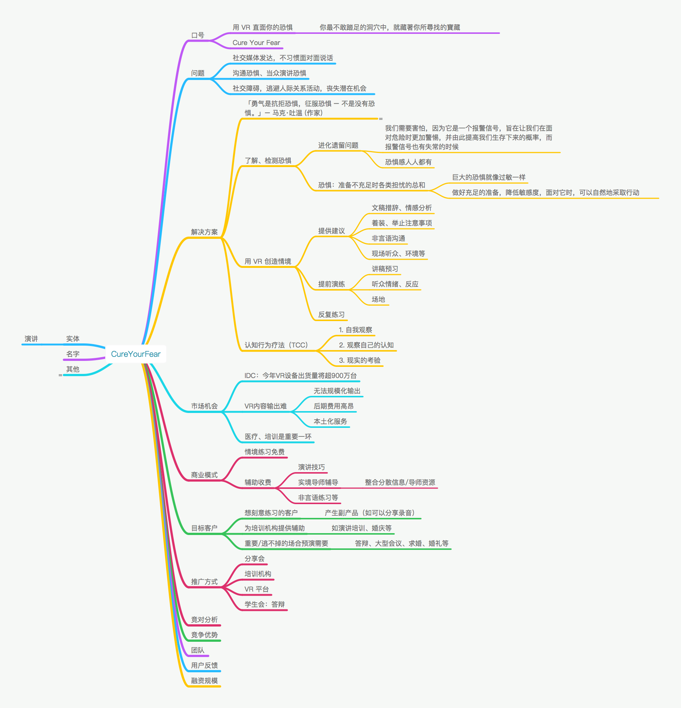

# PublicSpeaking
Overcome the fear of public speaking.

## 导图

1. 请用一段话清晰描述你们的项目是做什么的，并举例该产品最典型的一个或几个应用场景。
  - 治愈演讲恐惧症
  - 面对演讲，不安、紧张、甚至恐惧
2. 目标用户？请描绘下使用你们产品的一个典型用户肖像是什么样的。
  - 目标用户：演讲恐惧症人群
  - 典型用户画像：惧怕在小组、公司、公众前演讲，但又知道有必要克服
3. 解决了社会什么重大的问题? 你们是怎么解决的？请详细说明你们的解决方案（可附上路径结构图以作注释）
  - 问题：演讲恐惧完全可以克服，但人们并不了解、不愿承认、或找不到合适的方法
  - 解决方案：通过VR技术，模拟实际情境，逐步减轻紧张感及恐惧感
  - 架构：检测、治疗
4. 你们的产品直接或间接的国内外竞争对手有哪些？请仔细列举分析你们所面对的有力竞争对手，并证明你们能胜出的竞争优势或壁垒是什么。
  - 潜在竞对：
    * Public Speaking for Cardboard （Android APP）
    * Presentation Simulator （Oculus VR APP）
    * Speech Center （VR APP）
    * Psious （医疗机构）
  - 优势或壁垒：
    * 实景环境：非虚拟场景，现场感、观众更真实
    * 本地化：中文环境，观众的面貌、目光是重要因素
    * 可根据用户实际情况定制方案：坐着还是站着，现场大小，观众多少等
    * 商业模式：免费（检测、常用情境）+ 付费（特殊情景、高级服务）

aJiea 补充：

“治愈演讲恐惧症”，如何治愈？
- VR内治愈，个人使用
    - VR里观众对用户实际表现的及时反馈
    - VR里出现tips，帮助用户调整
- VR外治愈，场外辅助（付费）
    - 现实中引导员根据屏幕上用户的表现进行现场提点

Keynote 撰写素材收集
- 模板
- 背景图片
  - [Pinterest](https://www.pinterest.com/search/pins/?0=public%7Ctyped&1=speaking%7Ctyped&2=fear%7Ctyped&q=public%20speaking%20fear&rs=typed)
- 名人箴言
- 背景音乐
- 经典电影片段
- 项目名字
- Keynote 思路梳理
- 产品故事
- 产品故事优化（依据认知写作学）
- Keynote 模板
- 市场大小（心理咨询、治疗）
- 团队背景
- 项目进展全记录
